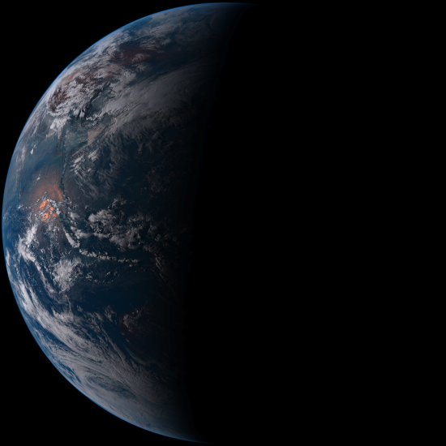

# Himawari8 Image Downloader

**himawari8downloader** is a tool to download near real time earth images taken by [**Himawari8**](https://en.wikipedia.org/wiki/Himawari_8) .

## Dependency
**himawari8downloader** depends on `PIL` and `Requests`:

```bash
pip install Pillow
pip install requests
```

## Usage

Just run `himawari.py'. With args *fout* and *scale*

*fout* is the path of the output image file.

*scale* set the size of the result image. The result image's width and height are both *scale*×550.
*scale* can be 1, 2, 4, 8, 16, 20.

For example:

```python
python himawari.py earth.png 2
```
## Result


